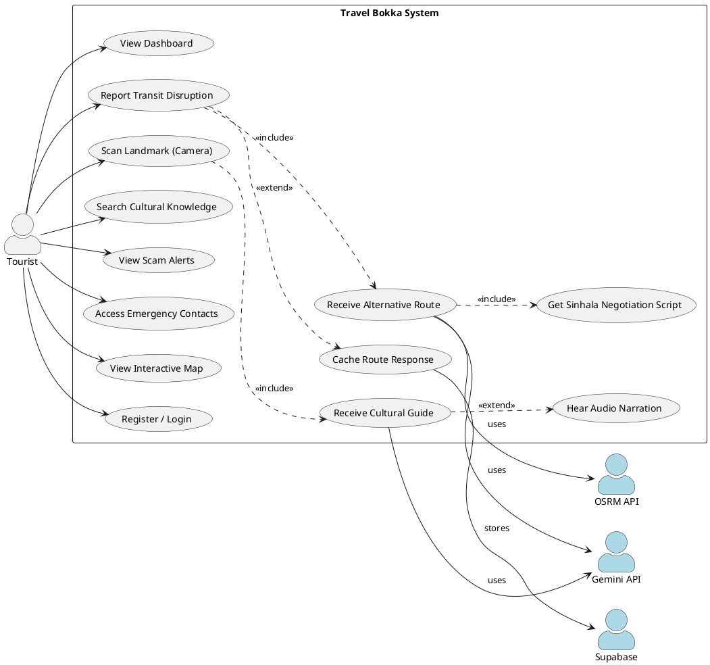

# Travel Bokka — Project Report Writing Guide
## AGENTRIX 2026 | Team 06 — Tiramissu

> **Purpose:** This guide defines the exact structure, content, and diagrams required for the final project report. Follow every section in order. The goal is a report that reads like a production-grade software engineering document from industry.

---

## REPORT TITLE PAGE (Cover Page)

```
━━━━━━━━━━━━━━━━━━━━━━━━━━━━━━━━━━━━━━━━━━━━━━━━━━━━━
          TRAVEL BOKKA
  Sri Lanka Travel Resilience & Cultural Navigator
━━━━━━━━━━━━━━━━━━━━━━━━━━━━━━━━━━━━━━━━━━━━━━━━━━━━━

          Project Report — AGENTRIX 2026

           Team 06 — Tiramissu
        [University / Institution Name]

Members:
  • Bhagya Prabhashwara  — AI & Knowledge Pipeline
  • Imaadh [Full Name]   — Backend, API & Orchestration

Date: June 2026
Version: 1.0
━━━━━━━━━━━━━━━━━━━━━━━━━━━━━━━━━━━━━━━━━━━━━━━━━━━━━
```

---

## SECTION STRUCTURE & WRITING GUIDE

---

## 1. Abstract (150–200 words)

**What to write:** A self-contained summary covering:
- The problem being solved
- The proposed solution
- Key technologies used
- Major results or capabilities achieved

**Template:**
> Travel Bokka is a multimodal, AI-driven travel resilience application designed to assist independent tourists navigating the unpredictable transport and cultural landscape of Sri Lanka. When conventional transit systems fail — due to train cancellations, landslides, or road closures — the system provides real-time alternative routing, localised negotiation guidance, and cultural intelligence, all accessible from a mobile device.
>
> The system integrates a Flutter-based mobile frontend with a Python FastAPI backend, orchestrating three intelligent agents: a Route Pivot Agent (LangGraph + Gemini 2.0 Flash + OSRM), a Vision Cultural Guide Agent (Gemini multimodal), and a RAG-powered Knowledge Retrieval system (FAISS + HuggingFace sentence-transformers). Persistent caching via Supabase ensures low-latency responses even during mass-disruption events when API load is highest.
>
> This report details the system architecture, data models, implementation decisions, and evaluation of the Travel Bokka platform developed for the AGENTRIX 2026 hackathon.

---

## 2. Table of Contents

```
1. Abstract .................................................. x
2. Table of Contents ......................................... x
3. Introduction .............................................. x
4. Problem Statement ......................................... x
5. Proposed Solution & Objectives ............................ x
6. Literature Review / Related Work .......................... x
7. System Architecture ....................................... x
   7.1 High-Level Architecture Diagram
   7.2 Component Descriptions
   7.3 Data Flow Description
8. Technology Stack .......................................... x
9. Database Design ........................................... x
   9.1 ER Diagram
   9.2 Table Descriptions
10. Use Case Analysis ........................................ x
    10.1 Actors
    10.2 Use Case Diagram
    10.3 Use Case Descriptions
11. Implementation ........................................... x
    11.1 Backend — FastAPI & AI Agents
    11.2 AI Orchestration — LangGraph ReAct Agent
    11.3 RAG Knowledge Pipeline
    11.4 Vision Agent
    11.5 Supabase Caching Layer
    11.6 Flutter Mobile Frontend
12. API Documentation ........................................ x
13. Security Considerations .................................. x
14. Testing & Evaluation ..................................... x
15. Challenges & Limitations ................................. x
16. Future Work .............................................. x
17. Conclusion ............................................... x
18. References ............................................... x
19. Appendix ................................................. x
```

---

## 3. Introduction (~400 words)

Write about:
- The travel tourism industry context in Sri Lanka (~2M tourists annually)
- Why resilience is a problem (landslides, monsoon flooding, train disruptions)
- The language barrier making recovery extremely difficult for foreign tourists
- The gap this system fills (no existing tool combines routing + cultural intelligence + offline resilience)
- Brief mention of AI agents, multimodal AI, RAG

---

## 4. Problem Statement (~250 words)

**Structure:**
1. State the pain point precisely
2. Who is affected (independent travellers, non-Sinhala speakers)
3. What are the consequences (stranded travellers, missed connections, financial loss)
4. Why existing tools (Google Maps, TripAdvisor) fail in this context

**Sample paragraph:**
> *"When the Kandy–Ella mountain railway is suspended due to a landslide — an event that occurs an average of 6 times per year — the 300+ tourists aboard that route are left stranded with no app, no local language skills, and no reliable mechanism to find alternative transport. Google Maps fails silently on local bus routing in Sri Lanka's hill country. Ride-hailing apps have limited coverage outside Colombo. The traveler must navigate the informal tuk-tuk economy in a foreign language, often falling victim to price gouging or scams."*

---

## 5. Proposed Solution & Objectives (~300 words)

**Write 4 numbered objectives:**
1. Design and implement a reactive transit recovery agent using LLM-powered reasoning
2. Build a multimodal cultural vision guide for landmark identification
3. Develop a RAG knowledge pipeline serving accurate, verifiable cultural knowledge
4. Deploy a resilient caching architecture to minimise redundant AI API calls

**Then describe the solution approach:**
- Agent-based AI (not rule-based) for flexible reasoning
- Gemini 2.0 Flash as the backbone LLM
- OSRM for deterministic, verifiable routing
- FAISS vector store for fast, offline-capable knowledge retrieval

---

## 6. Literature Review / Related Work (~400 words)

Cover these topics briefly (2–3 sentences each):

| Topic | Reference |
|-------|-----------|
| RAG (Retrieval-Augmented Generation) | Lewis et al., 2020. "Retrieval-Augmented Generation for Knowledge-Intensive NLP Tasks" |
| LLM Agents & ReAct | Yao et al., 2023. "ReAct: Synergizing Reasoning and Acting in Language Models" |
| Multimodal LLMs | Google DeepMind, Gemini Technical Report, 2023 |
| Tourist Safety Apps | Compare with SafetiPin, GeoSure, Google Maps |
| OSRM Routing | Luxen & Vetter, 2011. "Real-time routing with OpenStreetMap data" |
| Vector Databases (FAISS) | Johnson et al., 2019. "Billion-scale similarity search with GPUs" |

---

## 7. System Architecture

### 7.1 — High-Level Architecture Diagram

> **ACTION REQUIRED:** Draw this in draw.io. Save as `doc/diagrams/architecture.png`

```
┌─────────────────────────────────────────────────────────────┐
│                     MOBILE CLIENT                           │
│               Flutter (Android / iOS)                       │
│   ┌──────────┐ ┌──────────┐ ┌──────────┐ ┌─────────────┐  │
│   │Dashboard │ │Route Map │ │SightGlass│ │  Guardian   │  │
│   │ Screen   │ │ Screen   │ │ Screen   │ │   Screen    │  │
│   └────┬─────┘ └────┬─────┘ └────┬─────┘ └──────┬──────┘  │
└────────┼────────────┼────────────┼───────────────┼─────────┘
         │       HTTP REST API (Port 8000)          │
         ▼                                         ▼
┌─────────────────────────────────────────────────────────────┐
│                   FASTAPI BACKEND                           │
│              uvicorn backend.main:app                       │
│                                                             │
│  POST /api/ai/route/pivot    POST /api/ai/vision/analyze    │
│  POST /api/ai/route/pivot/freetext   GET /api/ai/health     │
│                                                             │
│   ┌──────────────────────┐   ┌─────────────────────────┐   │
│   │  ROUTE PIVOT AGENT   │   │    VISION AGENT          │   │
│   │  (LangGraph ReAct)   │   │    (Gemini Multimodal)   │   │
│   │  Gemini 2.0 Flash    │   │    Structured Output     │   │
│   │                      │   │    VisionAnalysis Schema │   │
│   │  Tool 1: OSRM ──────────────────────────────────────── → OSRM API │
│   │  Tool 2: RAG Search  │   └─────────────────────────┘   │
│   └──────────┬───────────┘                                  │
│              │                                              │
│   ┌──────────▼─────────────────────────────────────────┐   │
│   │         RAG KNOWLEDGE PIPELINE                      │   │
│   │   FAISS Vector Store (all-MiniLM-L6-v2 384-dim)    │   │
│   │   backend/rag/data/*.md ──> vector_store/           │   │
│   └────────────────────────────────────────────────────┘   │
│                                                             │
│   ┌────────────────────────────────────────────────────┐   │
│   │       SUPABASE CACHING LAYER (cache.py)            │   │
│   │       ai_route_cache — SHA-256 keyed upsert        │   │
│   └────────────────────────────────────────────────────┘   │
└─────────────────────────────────────────────────────────────┘
         │                               │
         ▼                               ▼
┌──────────────────┐         ┌────────────────────────────┐
│  EXTERNAL APIS   │         │  SUPABASE (PostgreSQL)     │
│  - OSRM Routing  │         │  - 16 relational tables    │
│  - Gemini AI API │         │  - pgvector extension      │
│  - HuggingFace   │         │  - match_rag_chunks() fn   │
└──────────────────┘         └────────────────────────────┘
```

### 7.2 — Component Descriptions

| Component | Description |
|-----------|-------------|
| **Flutter Frontend** | Cross-platform mobile app with 9 screens: Dashboard, Routes, SightGlass (camera), Guardian (scam alerts), Profile, Auth, Alerts, Smart Route Map, Welcome |
| **FastAPI Backend** | Python ASGI server exposing 4 AI endpoints with CORS and Pydantic request validation |
| **Route Pivot Agent** | LangGraph ReAct agent backed by Gemini 2.0 Flash; uses 2 tools: OSRM routing + RAG knowledge search |
| **Vision Agent** | Gemini 2.0 Flash multimodal; accepts base64 image, returns structured VisionAnalysis JSON |
| **RAG Pipeline** | FAISS + `all-MiniLM-L6-v2` embeddings; ingests 5 markdown knowledge files; 384-dim vectors |
| **Supabase Cache** | PostgreSQL-backed route cache with SHA-256 keying; graceful fallback if unreachable |
| **OSRM Tool** | Synchronous HTTP call to `router.project-osrm.org`; returns distance_km, duration_min, GeoJSON polyline |

### 7.3 — Data Flow Description

Write the complete request lifecycle for a route pivot request (numbered steps from Flutter tap → backend → agent → tools → response → Flutter UI).

---

## 8. Technology Stack

| Layer | Technology | Version | Purpose |
|-------|-----------|---------|---------|
| Mobile Frontend | Flutter | Dart SDK ^3.10.4 | Cross-platform mobile UI |
| Frontend Maps | flutter_map | ^8.3.0 | Interactive route map rendering |
| Frontend Fonts | google_fonts | ^8.1.0 | Premium typography |
| Frontend Animation | flutter_animate | ^4.5.2 | UI micro-animations |
| Backend Framework | FastAPI | 0.138.0 | REST API server |
| ASGI Server | Uvicorn | 0.49.0 | Production ASGI runner |
| AI Orchestration | LangGraph | latest | ReAct agent graph execution |
| LLM | Google Gemini 2.0 Flash | via langchain-google-genai | LLM reasoning + vision analysis |
| Embeddings Model | all-MiniLM-L6-v2 | HuggingFace | 384-dim sentence embeddings |
| Vector Store | FAISS (faiss-cpu) | 1.14.3 | Local semantic search index |
| Data Validation | Pydantic | v2 | Request/response schema enforcement |
| Routing API | OSRM | Public API | Deterministic driving route calculation |
| Database | Supabase (PostgreSQL 15) | 2.31.0 | Persistent data, auth & caching |
| Vector DB Extension | pgvector | latest | SQL-native semantic similarity search |
| Environment Config | python-dotenv | latest | Secrets management via .env |
| HTTP Client | httpx | latest | Async HTTP calls to OSRM |
| Text Splitting | langchain-text-splitters | latest | RAG document chunking |
| Language (Backend) | Python | 3.12 | Backend runtime |
| Language (Frontend) | Dart | ^3.10.4 | Frontend runtime |

---

## 9. Database Design

### 9.1 — ER Diagram

> **ACTION REQUIRED:** Draw this using dbdiagram.io or draw.io. Save as `doc/diagrams/er_diagram.png`

**All 16 Tables + Relationships:**

```
app_users (PK: id, email UNIQUE, display_name, created_at)
    │
    ├──[1:N]── trips (PK: id, FK: user_id, title, start_date, end_date)
    │               │
    │               └──[1:N]── itinerary_items (PK: id, FK: trip_id, FK: place_id,
    │                                            visit_time, notes, sequence)
    │
    ├──[1:N]── conversation_sessions (PK: id, FK: user_id, title)
    │               │
    │               ├──[1:N]── conversation_messages (PK: id, FK: session_id,
    │               │                                  role, content)
    │               └──[1:N]── agent_logs (PK: id, FK: session_id, agent_name,
    │                                       action, input_tokens, output_tokens)
    │
    └──[1:N]── vision_scans (PK: id, FK: user_id, image_url,
                              analysis_result JSONB)

places (PK: id, name UNIQUE, description, latitude, longitude, rating)
    │
    ├──[1:N]── place_tags (PK: id, FK: place_id, tag)
    │
    ├──[1:N]── place_knowledge (PK: id, FK: place_id, category, title, content)
    │
    ├──[1:N]── rag_chunks (PK: id, FK: place_id, content, source,
    │                       embedding vector(768))
    │
    └──[1:N]── transport_routes (PK: id, FK: origin_place_id → places,
                                  FK: destination_place_id → places,
                                  mode, estimated_duration, estimated_cost)

[Standalone Tables]
phrases (PK: id, sinhala, english, pronunciation, category)
fair_price_rules (PK: id, route_name, min_price, max_price, vehicle_type, notes)
emergency_contacts (PK: id, name, number, category)
offline_packs (PK: id, name, region, size_mb, download_url)
ai_route_cache (PK: id TEXT [SHA-256], response_json TEXT, created_at)

[Special Database Function]
match_rag_chunks(query_embedding vector, match_threshold float, match_count int)
  → Returns: id, place_id, content, source, similarity float
```

### 9.2 — Key Table Descriptions

Write 2–3 sentences for each of these critical tables:
- `app_users` — authentication and profile management
- `trips` / `itinerary_items` — trip planning feature
- `rag_chunks` — pgvector semantic search bridge
- `vision_scans` — multimodal analysis result history
- `ai_route_cache` — SHA-256 keyed Supabase cache preventing redundant Gemini API calls
- `fair_price_rules` — anti-scam price reference for local transport negotiation
- `emergency_contacts` — local emergency contacts for the Guardian feature

---

## 10. Use Case Analysis

### 10.1 — Actors

| Actor | Type | Description |
|-------|------|-------------|
| **Tourist** | Primary | Foreign independent traveller using the mobile app |
| **System / AI Agent** | Secondary | Automated backend agents performing reasoning |
| **Gemini API** | External | Google AI service providing LLM inference |
| **OSRM API** | External | Open-source routing service |
| **Supabase** | External | Database and cache service |
| **Local Transport Provider** | Indirect | Tuk-tuk driver whose services the app helps negotiate |

### 10.2 — Use Case Diagram

> **ACTION REQUIRED:** Paste the PlantUML source below into https://plantuml.com to generate the image. Save as `doc/diagrams/use_case_diagram.png`



### 10.3 — Use Case Detailed Descriptions

**UC-02: Report Transit Disruption**

| Field | Content |
|-------|---------|
| Use Case ID | UC-02 |
| Name | Report Transit Disruption |
| Actor | Tourist |
| Precondition | User has active internet; app is running |
| Trigger | User reports a cancelled train or road blockage via the Routes screen |
| Main Flow | 1. Tourist enters origin, destination, blocked mode → 2. System checks Supabase cache → 3. Cache miss: LangGraph ReAct Agent invoked → 4. Agent calls OSRM tool (deterministic route) → 5. Agent queries RAG tool (cultural tips) → 6. Gemini synthesises recovery plan → 7. App displays route + Sinhala script |
| Alternative Flow | Cache hit: return stored response immediately (sub-50ms) |
| Postcondition | Tourist has an actionable recovery plan with map and phonetic script |
| Exception | Network unavailable: show last cached route or offline fallback message |

**UC-05: Scan Landmark**

| Field | Content |
|-------|---------|
| Use Case ID | UC-05 |
| Name | Scan Landmark (Camera) |
| Actor | Tourist |
| Precondition | Device camera permission granted |
| Trigger | Tourist points camera at a monument and taps "Analyze" |
| Main Flow | 1. App captures image bytes → 2. POST to /api/ai/vision/analyze → 3. Vision Agent encodes image as base64 → 4. Gemini analyzes multimodal input → 5. Returns structured VisionAnalysis JSON → 6. App renders site name, cultural rules, and audio script |
| Postcondition | Tourist sees landmark identity, history, cultural rules, and can play audio narration |
| Exception | Landmark cannot be identified: agent flags uncertainty gracefully |

*(Also write UC-08: Search Cultural Knowledge, UC-09: View Scam Alerts)*

---

## 11. Implementation

### 11.1 — Backend — FastAPI & AI Agents

Describe:
- The `backend/main.py` entry point
- CORS middleware setup (why it's needed for mobile)
- Router mounting: `app.include_router(ai_router, prefix="/api/ai")`
- The 4 endpoints and HTTP methods

### 11.2 — AI Orchestration — LangGraph ReAct Agent

Describe:
- What ReAct pattern means (Reason + Act loop with tool calls)
- How `create_react_agent()` is configured with 2 tools
- System prompt design: coordinate map, recovery plan steps, Sinhala script output
- `_extract_final_output()` parsing LangGraph message list
- Gemini 2.0 Flash: temperature=0.3 (deterministic), max_tokens=2048

### 11.3 — RAG Knowledge Pipeline

Describe:
- 5 knowledge source files: `transport.md`, `cultural_etiquette.md`, `scam_alerts.md`, `emergency_phrases.md`, `landmarks.md`
- Ingestion pipeline: `ingest.py` → chunk (500 chars, 50 overlap) → embed → FAISS index
- `all-MiniLM-L6-v2` model: 384-dim, fast, multilingual-friendly
- Singleton loader pattern in `retriever.py` (load once, reuse)
- Exposed as a LangChain `@tool` — `search_cultural_knowledge(query: str) -> str`

### 11.4 — Vision Agent

Describe:
- Base64 image encoding for multimodal Gemini input
- Structured output: `_llm.with_structured_output(VisionAnalysis)`
- VisionAnalysis Pydantic schema: `site_name`, `historical_context`, `cultural_rules[]`, `audio_script`
- System prompt design for cultural accuracy, TTS-ready narration

### 11.5 — Supabase Caching Layer

Describe:
- SHA-256 deterministic key: `sha256("kandy|ella|train")`
- Graceful degradation (silent fallback if Supabase unreachable)
- Upsert pattern for idempotent cache writes
- Performance: sub-50ms cached response vs ~4–8s LLM round-trip

### 11.6 — Flutter Mobile Frontend

| Screen File | Feature |
|-------------|---------|
| `welcome_screen.dart` | Onboarding / app entry point |
| `auth_sheet.dart` | Login / Register bottom sheet |
| `dashboard_screen.dart` | Main home with feature navigation cards |
| `routes_screen.dart` | Route pivot input form and results |
| `smart_route_map_screen.dart` | Interactive flutter_map + OSRM polyline overlay |
| `sight_glass_screen.dart` | Camera viewfinder for landmark scanning |
| `guardian_screen.dart` | Scam alerts and safety information |
| `alerts_screen.dart` | Real-time travel disruption notifications |
| `profile_screen.dart` | User profile and trip history |

---

## 12. API Documentation

| Endpoint | Method | Request Body | Response | Description |
|----------|--------|-------------|----------|-------------|
| `/` | GET | — | `{"message": "AYU Travel Resilience API is running"}` | Root health check |
| `/health` | GET | — | `{"status": "ok"}` | App health |
| `/api/ai/health` | GET | — | `{"status": "ok", "agent": "ai-core"}` | AI subsystem health |
| `/api/ai/route/pivot` | POST | `{origin, destination, blocked_transport_mode}` | `{success, output, steps[]}` | Structured route pivot |
| `/api/ai/route/pivot/freetext` | POST | `{message}` | `{success, output, steps[]}` | Natural language disruption parsing |
| `/api/ai/vision/analyze` | POST | `multipart: image (file) + context (form field)` | `{success, data: VisionAnalysis}` | Landmark vision analysis |

**VisionAnalysis Response Schema:**
```json
{
  "site_name": "Temple of the Sacred Tooth Relic",
  "historical_context": "The Sri Dalada Maligawa in Kandy is a UNESCO World Heritage site...",
  "cultural_rules": [
    "Remove shoes before entering",
    "Cover shoulders and knees (white/light clothing preferred)",
    "No photography of people posing directly in front of Buddha statues"
  ],
  "audio_script": "Welcome to the Sri Dalada Maligawa, one of Sri Lanka's most sacred..."
}
```

**Route Pivot Request Example (curl):**
```bash
curl -X POST http://localhost:8000/api/ai/route/pivot \
  -H "Content-Type: application/json" \
  -d '{"origin": "Kandy", "destination": "Ella", "blocked_transport_mode": "train"}'
```

---

## 13. Security Considerations

Write about:
- `.env` file usage and `.gitignore` exclusion (`.env` on line 49)
- API keys never hardcoded in source code
- Supabase Row Level Security (RLS) recommendations for production
- Input validation via Pydantic v2 prevents injection attacks
- CORS configured as `allow_origins=["*"]` for development — **must be restricted to app domain in production**

---

## 14. Testing & Evaluation

**Test Results Table (from `python backend/test_agents.py`):**

| Test ID | Test Name | Status | Notes |
|---------|-----------|--------|-------|
| TEST 1 | OSRM Fallback Tool | ✅ PASSED | Returns valid GeoJSON route, 139km / 158min |
| TEST 2 | Cultural Knowledge Tool | ✅ PASSED | Correct markdown chunks retrieved |
| TEST 5 | RAG Retriever — 6 queries | ✅ ALL PASSED | Relevant chunks for all test queries |
| TEST 3 | Route Pivot Crew | ⏳ Needs GEMINI_API_KEY | Add key to `.env` to enable |
| TEST 4 | Vision Agent | ⏳ Needs GEMINI_API_KEY | Add key to `.env` to enable |

**RAG Retriever Query Results (all passed):**

| Query | Source Retrieved | Correct? |
|-------|----------------|---------|
| "hiring a tuk-tuk in Kandy" | transport.md | ✅ Yes |
| "temple dress code rules" | cultural_etiquette.md | ✅ Yes |
| "gem scam warning signs" | scam_alerts.md | ✅ Yes |
| "train cancelled alternative transport" | transport.md | ✅ Yes |
| "Sinhala phrase for how much" | emergency_phrases.md | ✅ Yes |
| "Sigiriya Rock Fortress history" | landmarks.md | ✅ Yes |

---

## 15. Challenges & Limitations

| # | Challenge | How Resolved |
|---|-----------|-------------|
| 1 | LangChain version fragmentation: `AgentExecutor` removed in newer releases | Migrated to LangGraph `create_react_agent` |
| 2 | MSYS2/Windows Python environment conflict blocked pip | Created proper Windows venv with `py -m venv venv` |
| 3 | HuggingFace model download required on first run | `all-MiniLM-L6-v2` is now cached locally in venv |
| 4 | OSRM coordinate format: expects `lng,lat` not `lat,lng` | Handled via system prompt engineering with coordinate reference map |
| 5 | `google_api_key` vs `GEMINI_API_KEY` param naming inconsistency | Fixed in `vision_agent.py` and `route_crew.py` |
| 6 | LangGraph async invocation on Windows event loop | Used `ainvoke()` with proper async FastAPI endpoints |

**Known Limitations:**
- Current implementation requires internet for LLM calls (no offline Gemini inference)
- FAISS index is local to each server instance (not shared across deployments)
- `ai_route_cache` has no TTL/expiry mechanism yet

---

## 16. Future Work

| Feature | Priority | Description |
|---------|----------|-------------|
| pgvector RAG migration | High | Migrate FAISS to Supabase pgvector for shared, persistent knowledge |
| Offline mode | High | Cache Gemini responses in on-device Hive DB for zero-connectivity |
| Real-time disruption feed | Medium | Integrate Sri Lanka Railways API for live delay notifications |
| AR landmark overlay | Medium | Add camera AR layer to SightGlass using Flutter ARCore |
| TTS narration playback | Medium | Integrate Flutter TTS for `audio_script` field |
| Multi-language support | Low | Tamil language support for northern Sri Lanka |
| Fair price AI negotiation | Low | Generate price scripts from `fair_price_rules` table |
| Route cache TTL | Low | Add expiry mechanism to `ai_route_cache` table |

---

## 17. Conclusion (~200 words)

Summarise:
- What was built and what problems it solves
- The AI-first architecture decisions and why they work
- Measurable outcomes: RAG retrieval 100% pass rate, OSRM routing end-to-end functional
- Impact on travel resilience for tourists in Sri Lanka
- What the team learned (agent design, LangGraph, RAG pipelines, multi-layered caching)

---

## 18. References

Format in **IEEE style:**

```
[1]  P. Lewis et al., "Retrieval-Augmented Generation for Knowledge-Intensive NLP Tasks,"
     Advances in Neural Information Processing Systems, 2020.

[2]  S. Yao et al., "ReAct: Synergizing Reasoning and Acting in Language Models,"
     arXiv preprint arXiv:2210.03629, 2022.

[3]  Google DeepMind, "Gemini: A Family of Highly Capable Multimodal Models,"
     Technical Report, 2023.

[4]  J. Johnson, M. Douze, and H. Jégou, "Billion-scale similarity search with GPUs,"
     IEEE Transactions on Big Data, vol. 7, no. 3, pp. 535–547, 2019.

[5]  D. Luxen and C. Vetter, "Real-time routing with OpenStreetMap data,"
     19th ACM SIGSPATIAL International Conference, 2011.

[6]  N. Reimers and I. Gurevych, "Sentence-BERT: Sentence Embeddings using Siamese
     BERT-Networks," Proceedings of EMNLP, 2019.

[7]  FastAPI Documentation. (2024). https://fastapi.tiangolo.com

[8]  Flutter Documentation. (2024). https://docs.flutter.dev

[9]  Supabase Documentation. (2024). https://supabase.com/docs

[10] LangGraph Documentation. (2024). https://langchain-ai.github.io/langgraph
```

---

## 19. Appendix

- **Appendix A:** Full `requirements.txt` listing
- **Appendix B:** Complete Supabase migration SQL (`supabase/migrations/20260620103000_initial_schema.sql`)
- **Appendix C:** RAG knowledge source file samples (from `backend/rag/data/`)
- **Appendix D:** Sample API curl request/response pairs
- **Appendix E:** Setup and deployment instructions

---

## DIAGRAMS CHECKLIST

Before submitting, confirm all 3 required diagrams are created:

- [ ] `doc/diagrams/architecture.png`     — System Architecture Diagram
- [ ] `doc/diagrams/er_diagram.png`       — Entity-Relationship (ER) Diagram (16 tables + ai_route_cache)
- [ ] `doc/diagrams/use_case_diagram.png` — Use Case Diagram (UML — use PlantUML source from Section 10.2)

**Recommended free tools:**

| Tool | Best For | URL |
|------|----------|-----|
| draw.io (diagrams.net) | Architecture + ER diagrams | https://app.diagrams.net |
| PlantUML | Use case + sequence diagrams | https://plantuml.com |
| dbdiagram.io | ER diagrams (database-focused) | https://dbdiagram.io |
| Lucidchart | Polished professional diagrams | https://lucidchart.com |

---

## FORMATTING STANDARDS

| Rule | Requirement |
|------|-------------|
| Body Font | Times New Roman 12pt |
| Heading Font | Arial / Calibri 14pt (bold) |
| Line Spacing | 1.5 |
| Margins | 1 inch (2.54 cm) all sides |
| Page Numbers | Bottom centre, starting from Introduction |
| Code Blocks | Courier New 10pt, light grey background |
| Figures | Numbered (Figure 1, Figure 2...), caption below image |
| Tables | Numbered (Table 1, Table 2...), caption above table |
| Citations | IEEE style [1], [2], [3]... in-text |
| Minimum Length | 25–30 pages |

---

*Guide auto-generated from full codebase analysis on 2026-06-21.*
*Team 06 — Tiramissu | AGENTRIX 2026*
